## swarm使用

### 1. swarm常用命令节选
```
# 查看swarm集群情况
docker node ls

# 初始化swarm集群的manager节点
docker swarm init --advertise-addr <IP-String>

# 修改时区和时间
cp /usr/share/zoneinfo/Asia/Shanghai  /etc/localtime

date -s "2019-05-13 22:44"

```

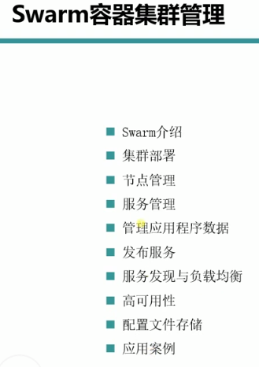

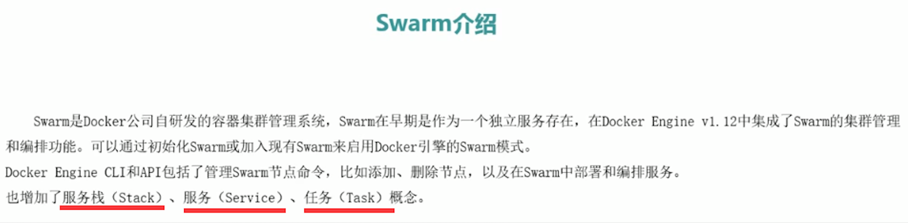

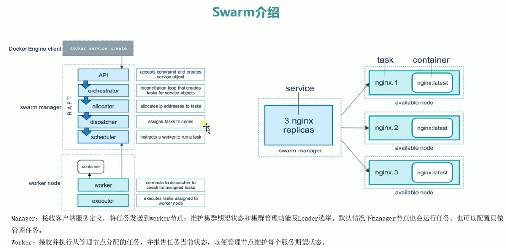

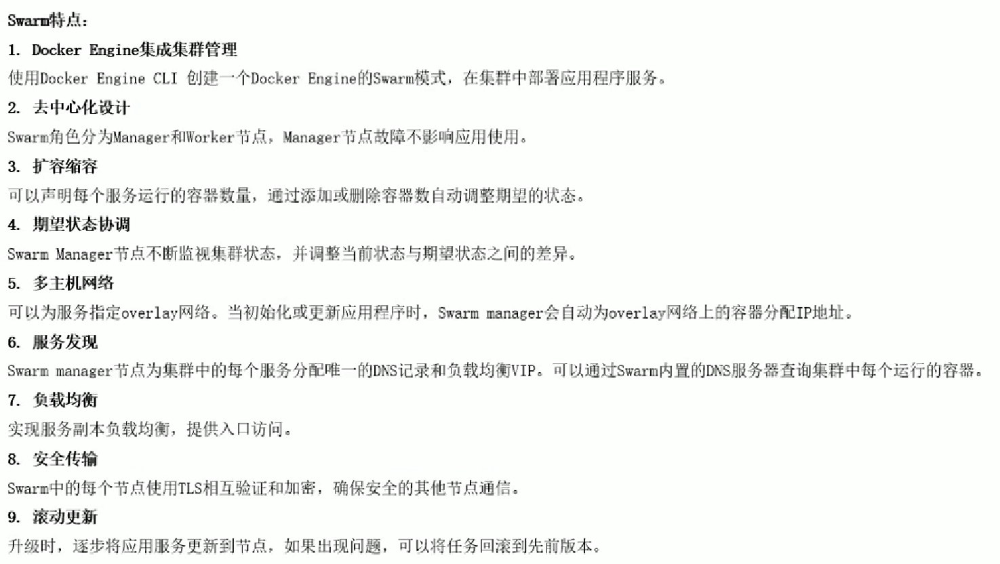

### 2.  部署和常用命令
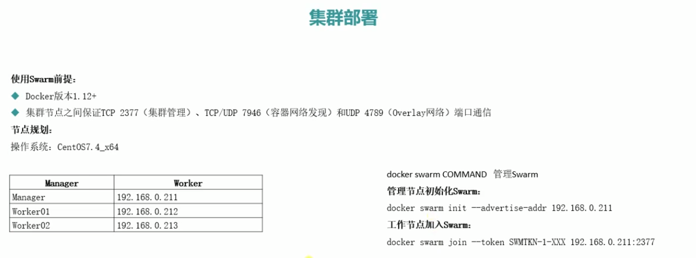

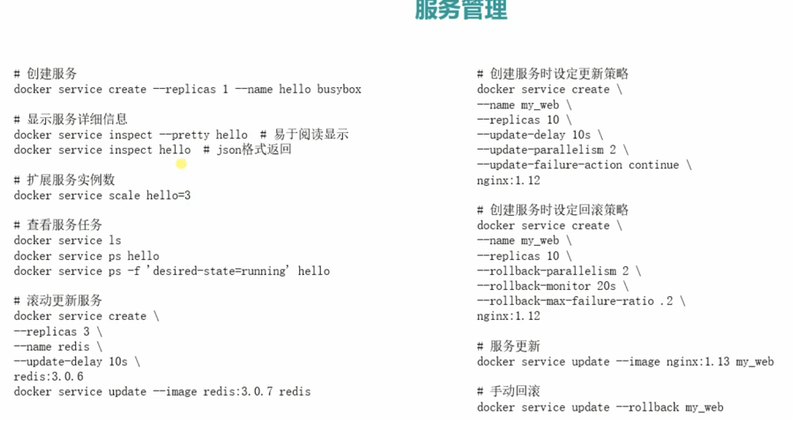

 ### 3. 数据持久化
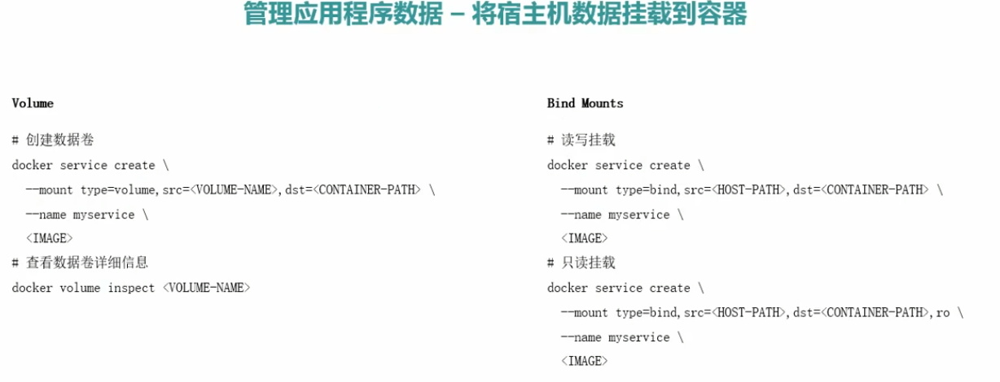
 
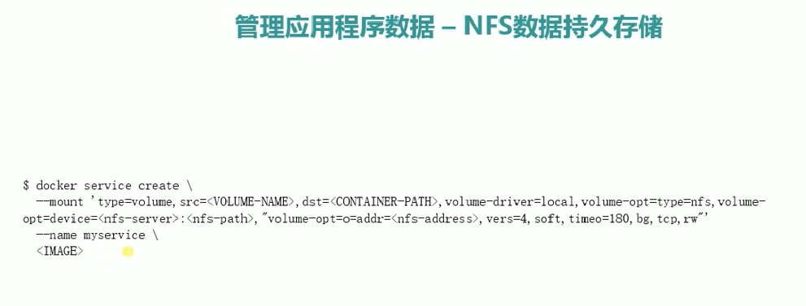

 ### 4.发布服务和负载均衡
 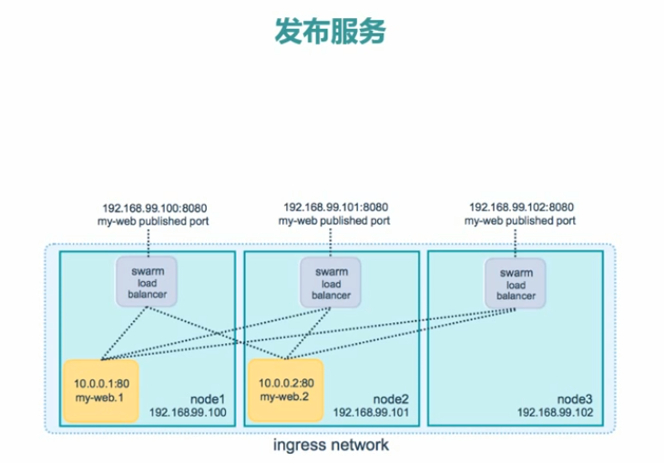
 
 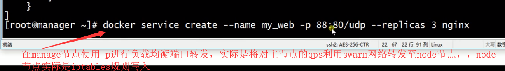
 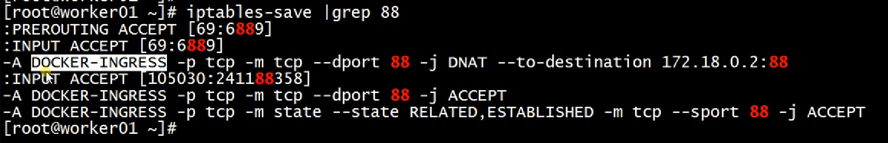
 ##### 在manage节点使用 $docker network ls  可以查看集群内组网模式和信息（即可以查看有几个swarm网络）  需要注意该manage节点不比k8s的master，他仅是处理docker swarm的CURD分发命令，其生死不影响集群有效性，实现了去中心设计
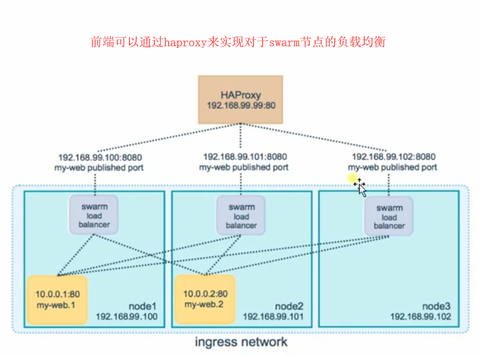

### 5.服务发现
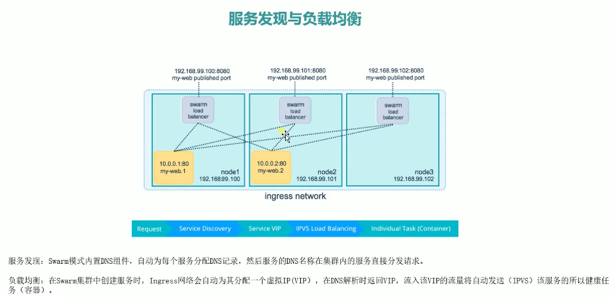
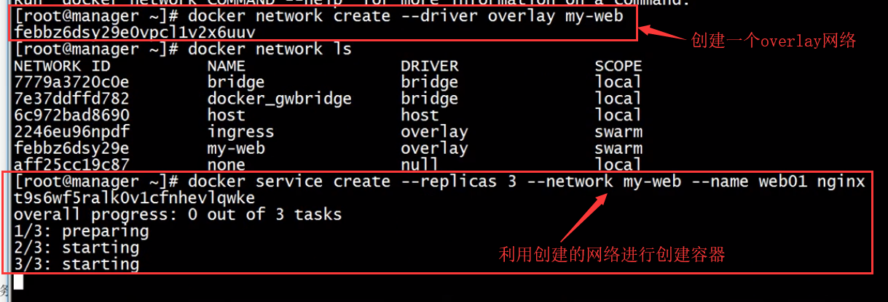
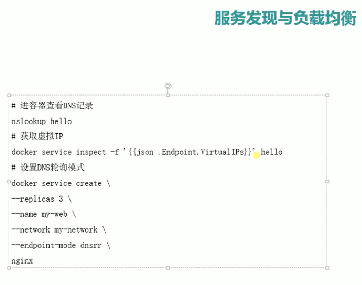

#### 服务发现机制实例
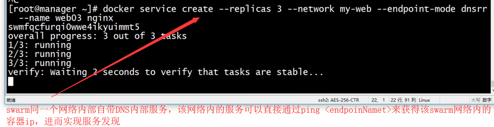
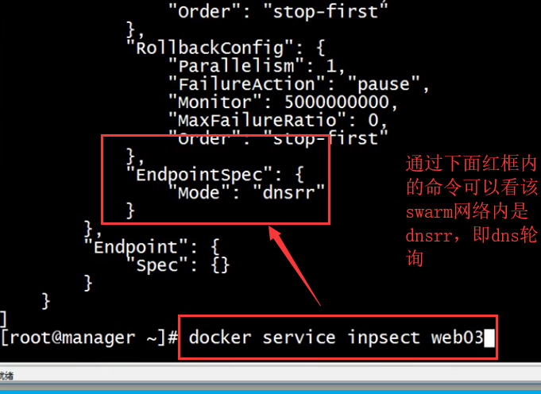
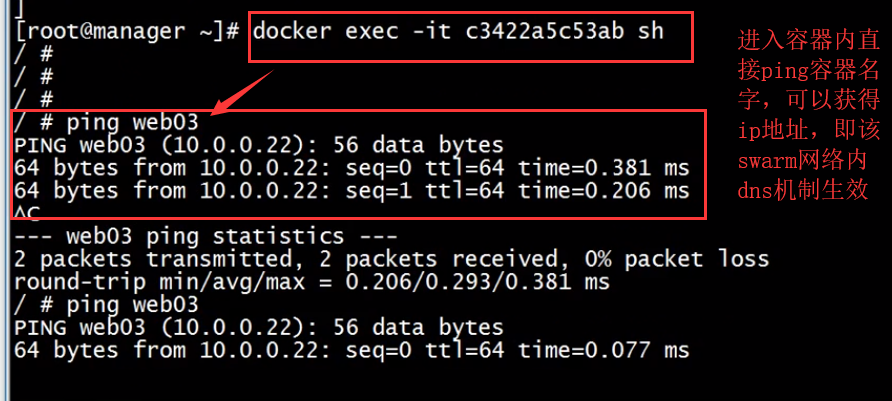
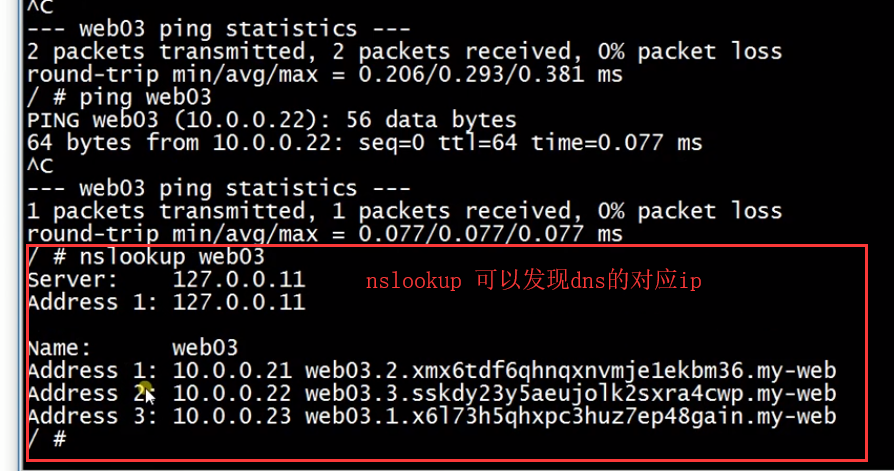

### 6.高可用架构
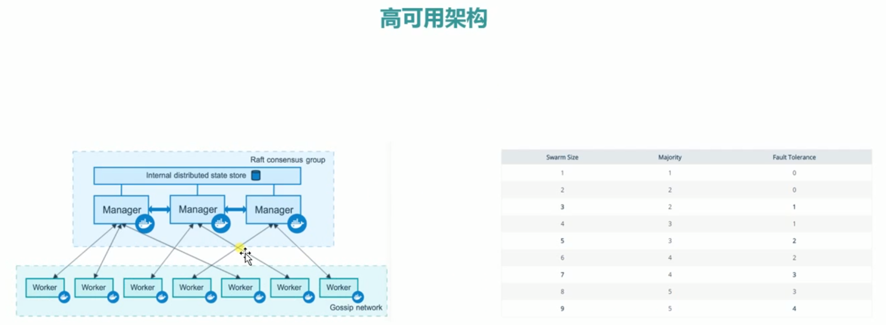
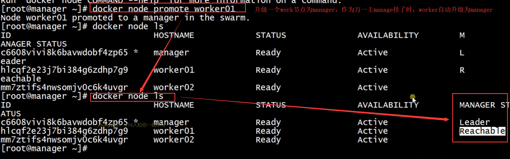
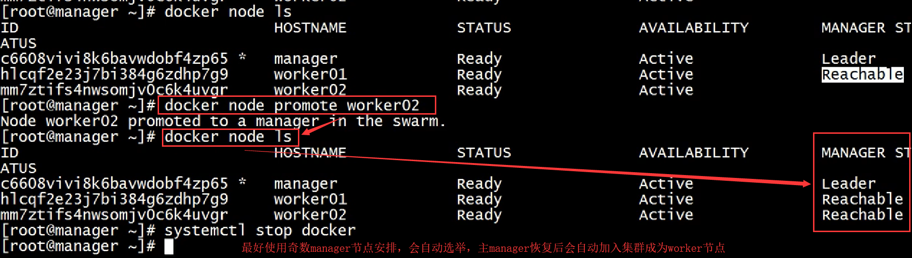
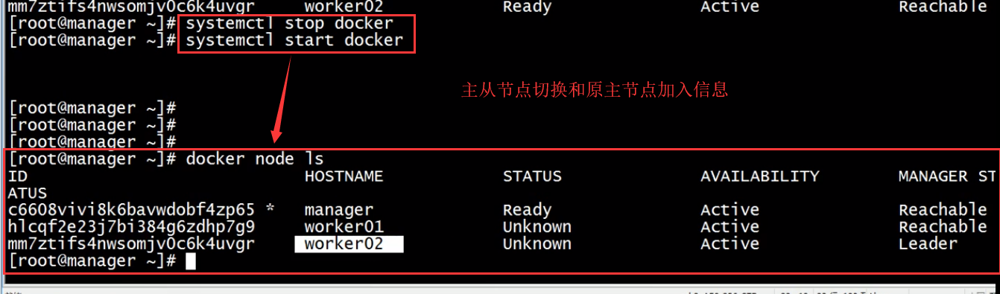

### 7.配置文件管理
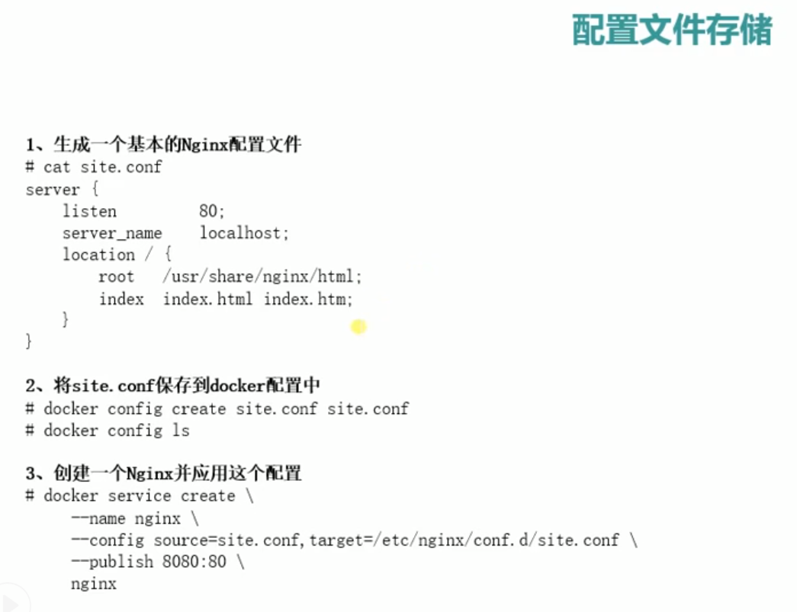


### 8.实例
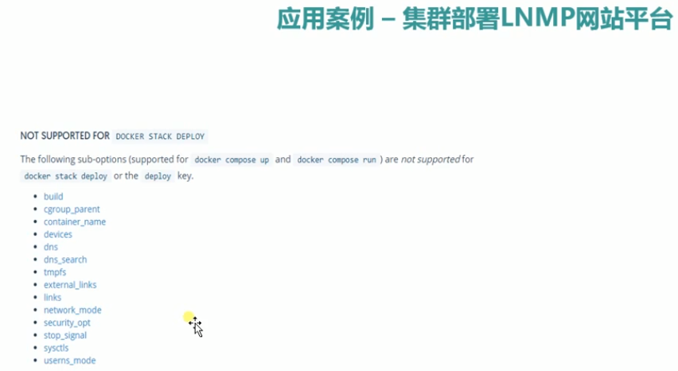
```
用于swarm的DockerFile地址 ：https://drive.google.com/file/d/1sdLKMltgxHVBnvqBxTqp-A_h0UoxURBt/view?usp=sharing
```
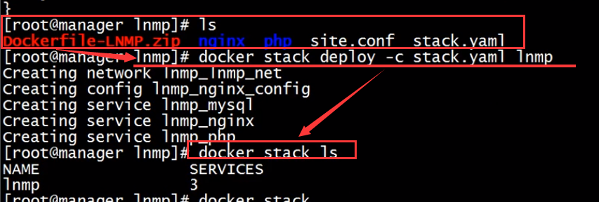
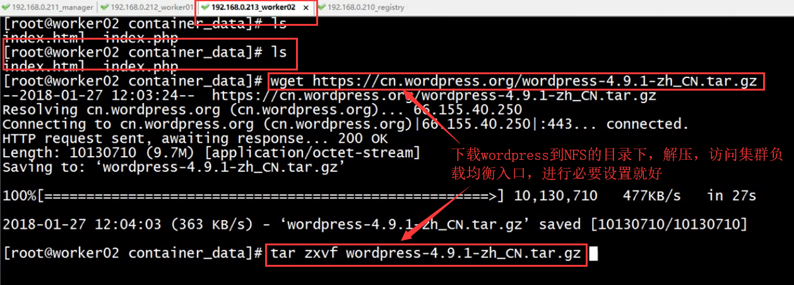


,
.
.
.
.
.,
.
.
.
.
.,
.
.
.
.
.,
.
.
.
.
.,
.
.
.
.
.


===========================================
`http://blog.51cto.com/lizhenliang`